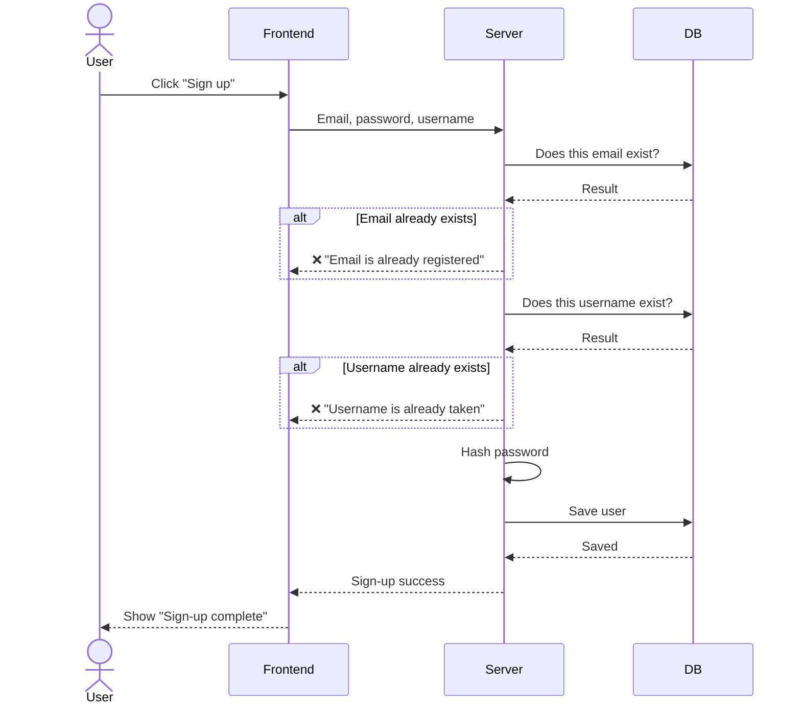
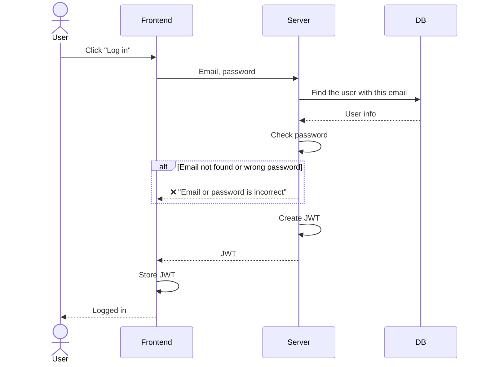
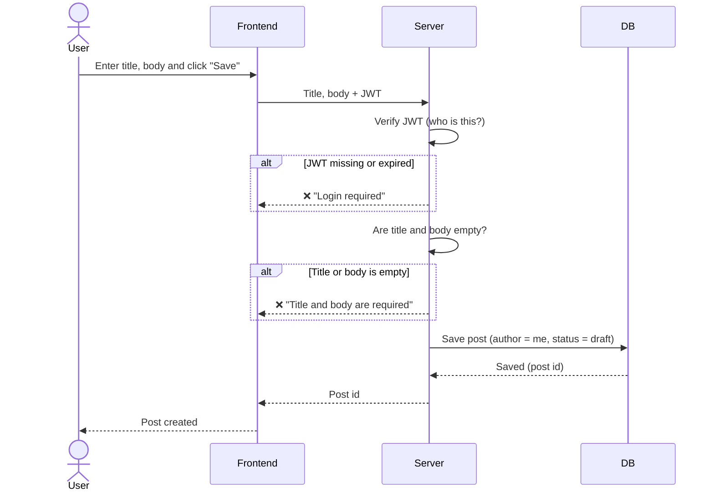

# Sequence Diagrams

> 🚧 **Draft** — P0 only. ①–③ done, ④–⑦ in progress.
> Related issue: 3. Sequence diagrams

Solid arrow (→) = request, dashed arrow (⇢) = response. `alt` boxes show failure cases.

---

## ① Sign up

## ② Log in

## ③ Create a post

## ④ Edit / delete a post
TBD

## ⑤ Post list
TBD

## ⑥ Post detail
TBD

## ⑦ Publish
TBD
