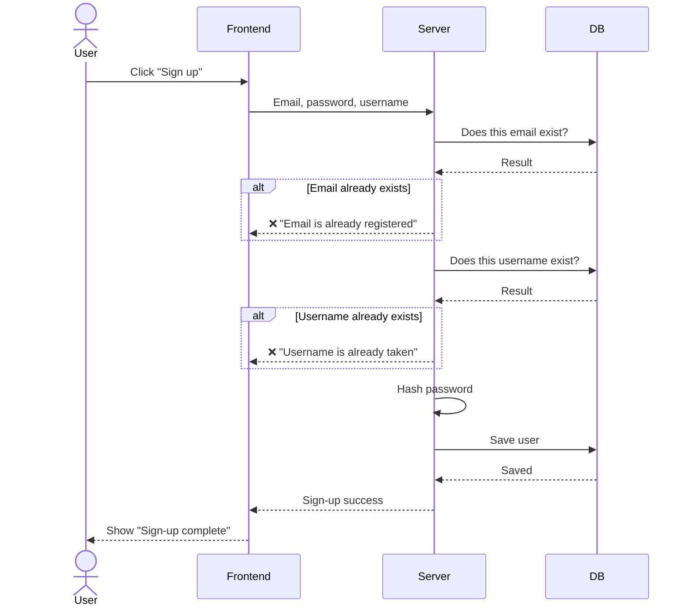
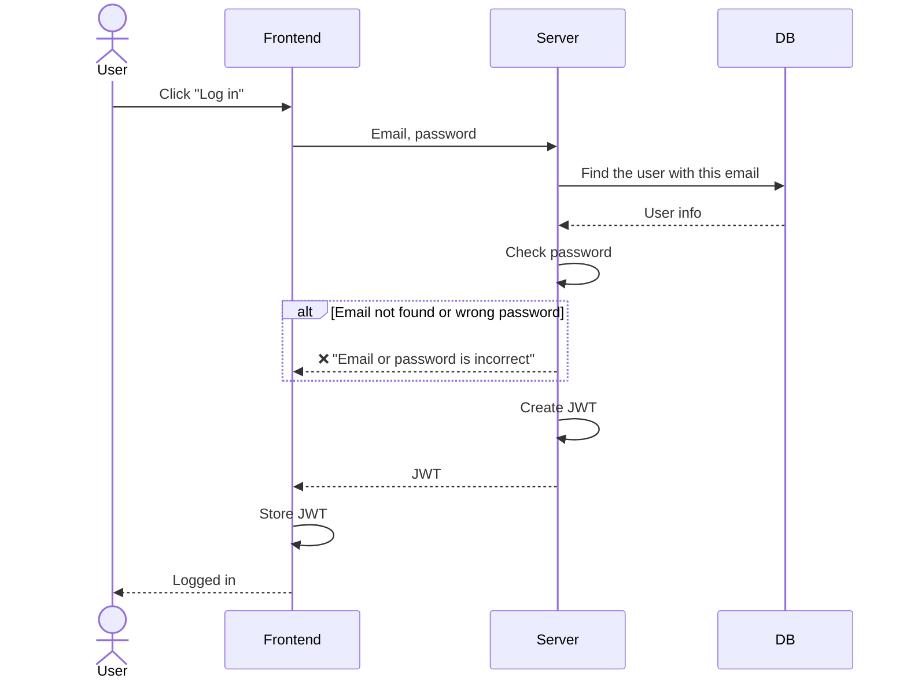

# Sequence Diagrams — Auth

> 🚧 **Draft** — P0 only.
> Related issue: 3. Sequence diagrams

Solid arrow (→) = request, dashed arrow (⇢) = response. `alt` boxes show failure cases.

---

## ① Sign up

## ② Log in

