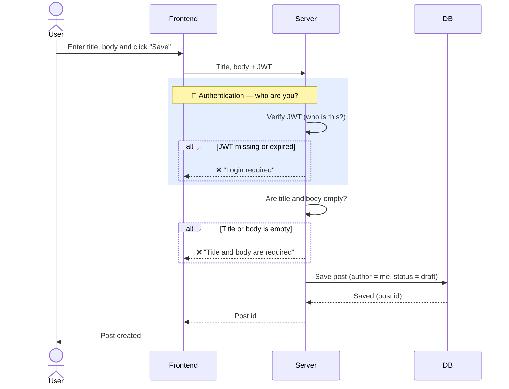
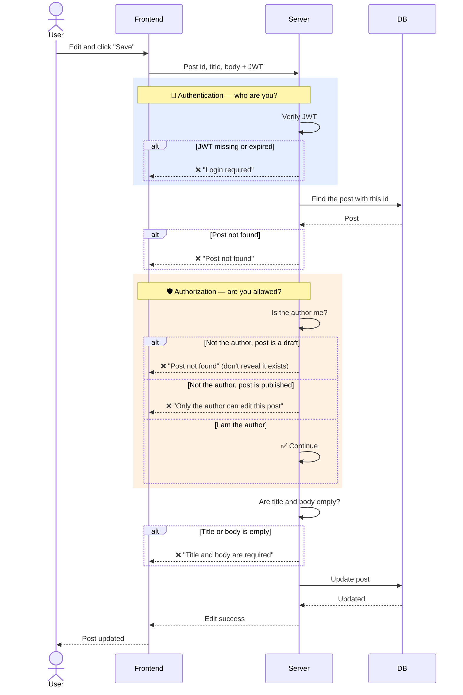
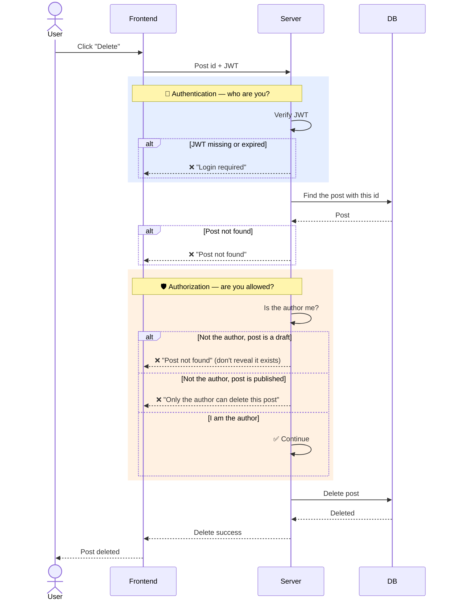
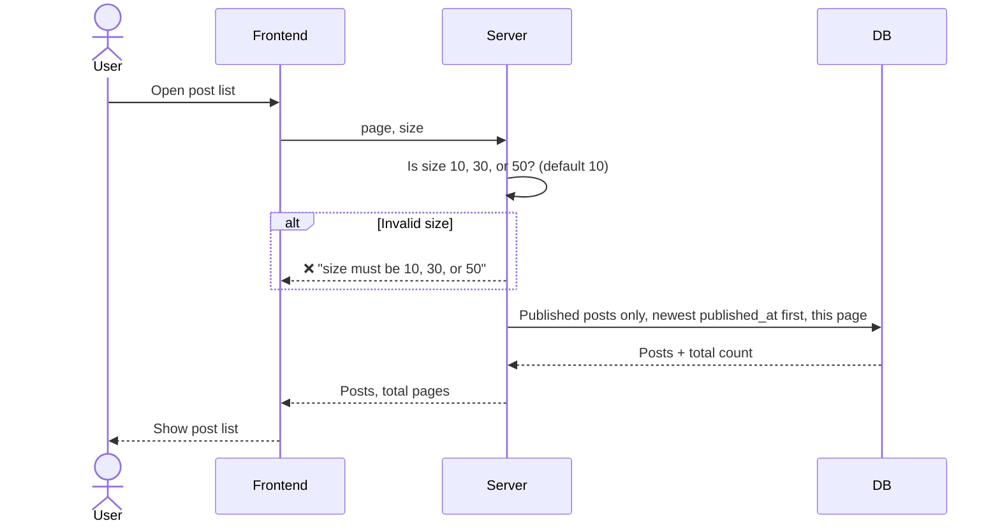
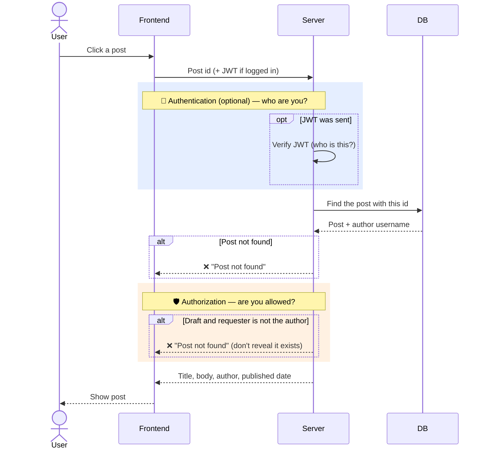
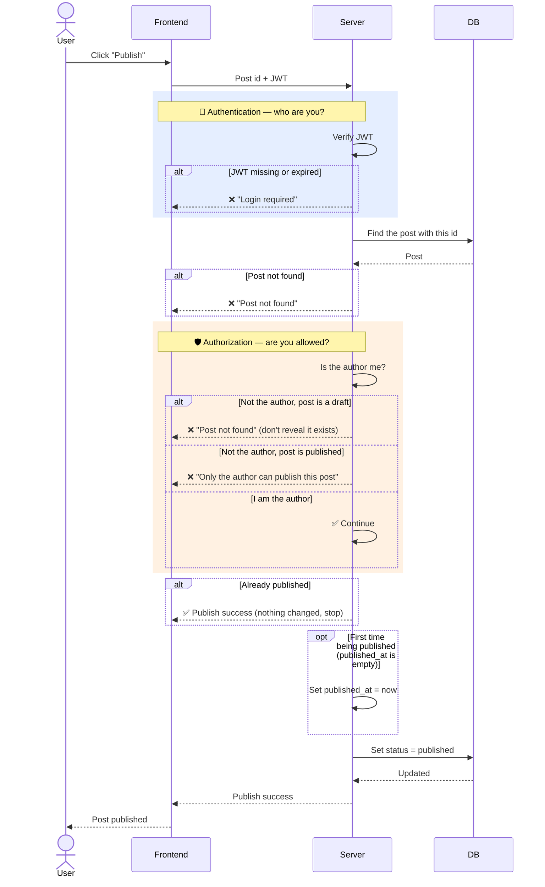
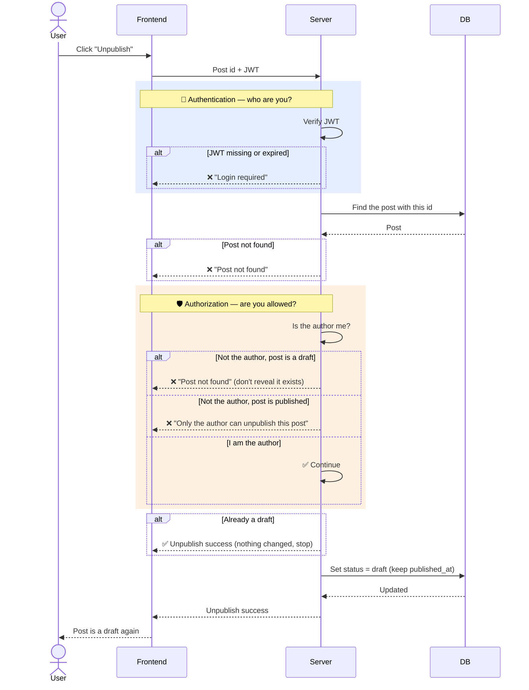
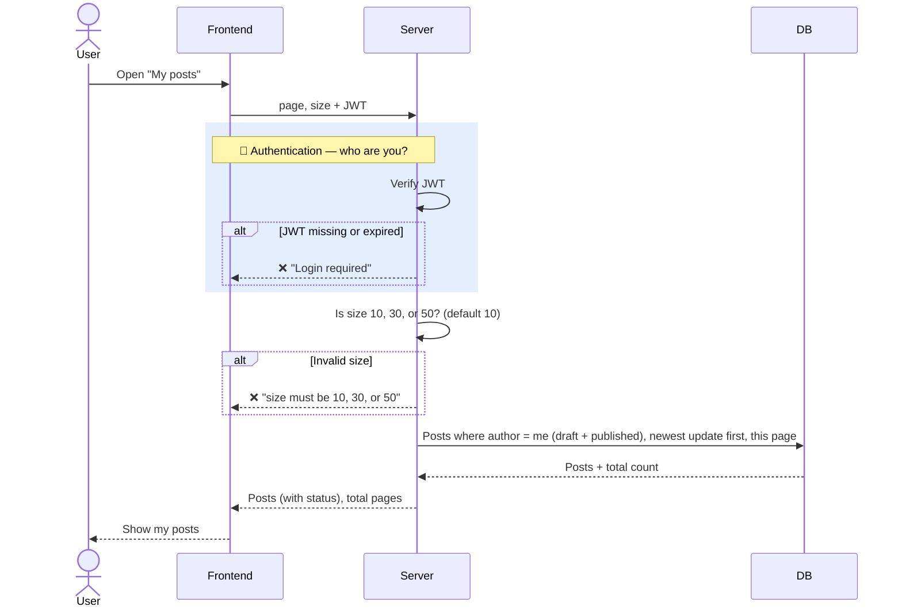

# Sequence Diagrams — Post

> 🚧 **Draft** — P0 only.
> Related issue: 3. Sequence diagrams

Solid arrow (→) = request, dashed arrow (⇢) = response. `alt` boxes show branches. A response to the Frontend (⇢) ends the request; `✅ Continue` means the flow keeps going.

Colored boxes mark two kinds of checks:
- 🔑 **Authentication** (blue) — *who are you?* The server verifies the JWT to find out who is sending the request.
- 🛡️ **Authorization** (orange) — *are you allowed to do this?* The server checks whether this user may act on this post.

Other checks (does the post exist? is the input valid? is it already published?) are the same for everyone, so they are not authorization.

---

## ③ Create a post (saved as draft)

Any logged-in user can create a post, so there is no authorization step.

## ④ Edit / delete a post

### Edit

### Delete

## ⑤ Post list

No login needed, so there is no authentication or authorization step.

## ⑥ Post detail

No login needed. JWT is sent if the user is logged in (needed to see their own drafts).

## ⑦ Publish / unpublish

### Publish

### Unpublish

`published_at` is **not** cleared, so publishing again keeps the original date.

## ⑧ My posts

Login required. Shows my own posts, both draft and published. The query only returns my posts, so there is no separate authorization step.

